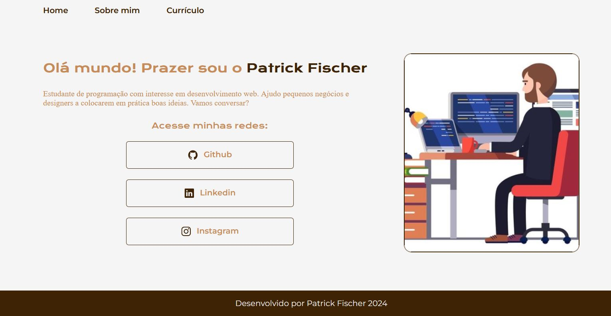

# Portfólio Olá, Bem vindo ao meu projeto de portfólio.

## Meu primeiro portifólio

Desenvolvido como parte das aulas dos cursos inciais de HTML e CSS da Alura, como aluna turma 6 do projeto ONE!

## Ferramentas utilizadas:

* HTML

* CSS

* Flex-box

* Git e Github

## Feito por:

### Patrick Fischer Marques

### Linkedin: https://www.linkedin.com/in/patrick-fischer-webdev/